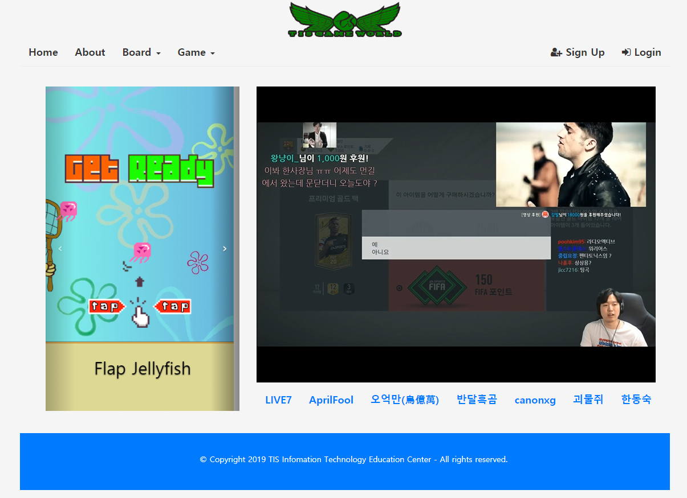
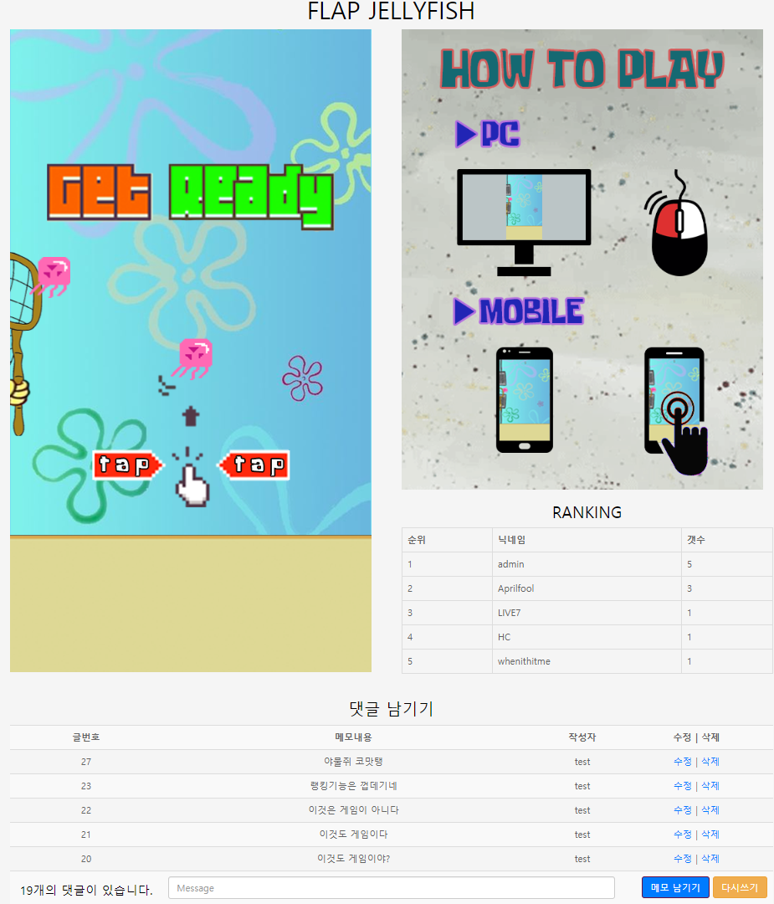

# TIS-GameWorld
-------------
## 1. 목차
```
.TIS-GameWorld
├── 1.목차
├── 2.URL
├── 3.개요
├── 4.게임소개
├── 5.사용법
|   ├── 5.1.개발 언어
|   └── 5.2.실행 방법
|       ├── 5.2.1 실행 환경 세팅
|       └── 5.2.2 실행
└── 6.스크린샷
|   ├── 6.1.Main 화면
|   └── 6.2.Game 화면
```

## 2. URL 
# http://15.164.66.10/gameworld/


## 3. 개요
 - **MVC 패턴 (MODEL2 방식)** 으로 개발된 **웹게임 포털사이트**입니다. 
 - 사이트에는 게임 외에도 회원가입과 로그인, 공지사항, 자유게시판, 랭킹 기능이 구현되어 있습니다.
 - 해당 사이트는 회원가입 및 로그인을 해야 정상적인 이용이 가능하도록 했습니다.
 
 
 
## 4. 게임소개 (FLAP JELLYFISH)
- FLAP JELLYFISH는 **JavaScript**로 개발된 아케이드 게임입니다.
- Flappy Bird 게임과 안드로이드6.0의 이스터에그였던 게임(Flappy Android)을 벤치마킹하여 제작하였습니다.
- 조작은 마우스 클릭으로 가능하고 모바일로 플레이 하는 경우에는 터치로 조작이 가능합니다.
- GAME OVER가 되면 로그인 했던 아이디로 랭킹이 등록됩니다.


## 5. 사용법
### 5.1. 개발 환경 & 개발 툴
- Programing Language : HTML, CSS, JavaScript, jQuery, Java 8, JSP, Servlet
- Framework : BootStrap, MyBati
- Database : Oracle Database 11g Express 
- Server : Apache Tomcat 8.5 
- OS: Windows 10

-----------------------------------------------------------------------------

- Tool : Eclipse, Pingendo 
- DB Modeling Tool : ERD Cloud 
- Graphic Tool : Adobe Photoshop CC


### 5.2. 실행 방법
#### 5.2.1 실행환경 세팅
```
# 1. 이클립스에 해당 프로젝트를 import 합니다.
- mybatis.jar, ojdbc6.jar, taglibs-standard-compat-1.2.5.jar, taglibs-standard-impl-1.2.5.jar, taglibs-standard-jstlel-1.2.5.jar, taglibs-standard-spec-1.2.5.jar, tomcat-dbcp.jar, tomcat-jdbc.jar 
총 8개의 jar 파일이 lib 폴더에 포함되어 있습니다. 
# 2. connection pool이 작동하는지 connect 여부를 확인합니다.
- common/config 폴더의 db.properties 파일, META-INF 폴더의 context.xml 파일, common/util 폴더의 DBUtil.java 파일에서 설정 값을 확인해주세요.
# 3. WebContent 폴더에 있는 oracle.sql로 테이블을 만드십시오. 
- 총 8개의 테이블이 있지만 해당 프로젝트에는 FLAP JELLYFISH 게임만 이용할 수 있기 때문에 랭킹 관련 테이블은 Flap Jellyfish랭킹 부분만 생성하시면 됩니다.
# 4. 이렇게 하면 세팅은 완료됩니다.
```
#### 5.2.2 실행
```
# 1. 설정이 완료되면 server를 시작하고, 웹 사이트 주소 창에 http://localhost:8080/tisgameworld/main.do를 입력하시면 됩니다. 
- 포트 번호(8080)는 본인의 컴퓨터에 설정된 톰캣의 포트번호로 변경해주시기 바랍니다. 
(WEB-INF 폴더의 Command.properties 파일을 여시면 사이트의 url이 열거되어 있습니다.)
# 2. 회원가입을 해야 원활한 사이트 이용이 가능합니다.
- admin으로 가입하면 해당 계정은 관리자 계정이 됩니다.
# 3. 사이트를 이용하시거나 게임을 실행하시면 됩니다.
```


## 6. 스크린샷

### 6.1. Main 화면
 
 -------------

### 6.2. Game 화면
 
 -------------
